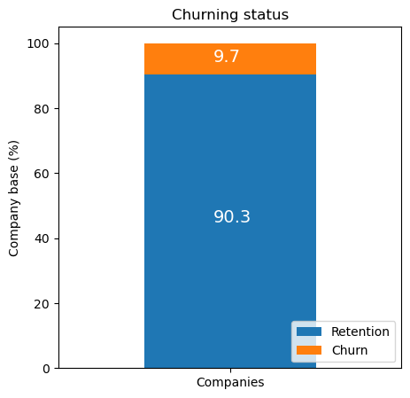
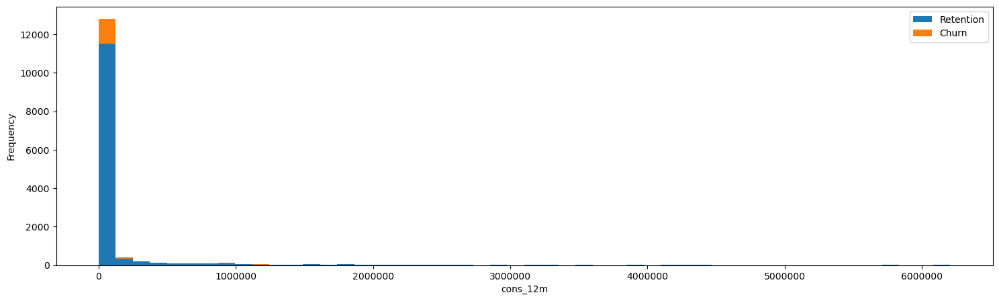

# PowerCo Customer Churn Prediction - BCG Data Science Project

*[Project Link](https://www.theforage.com/simulations/bcg/data-science-ccdz)*

## Project Background

PowerCo, a leading gas and electricity utility serving small and medium-sized enterprises (SMEs), is facing increasing customer churn due to a highly competitive energy market. Customers are leaving for better offers, making it imperative to understand and predict churn behavior.

The primary goal of this project is to analyze customer churn for PowerCo, diagnose the factors driving churn, and develop a predictive model to prevent future churn. Boston Consulting Group (BCG) was engaged to provide this analysis, focusing on the SME division.

---

## Procedure Overview

### 1. [Exploratory Data Analysis (EDA)](DataAnalysis/EDA)

Started by performing an exploratory analysis of the data, which consisted of:
- **Historical customer data**: Usage, signup date, forecasted usage, and more.
- **Pricing data**: Both variable and fixed pricing details.
- **Churn data**: Whether each customer has churned or not.

Key steps:
- **Data types and descriptive statistics**: Understanding the structure of the data.
- **Distribution of key variables**: Visualizing and analyzing the data for any patterns or anomalies.

### 2. [Feature Engineering](DataAnalysis/Feature_Engineering)

In this step, I enriched the dataset by creating relevant features that can influence churn prediction, such as:
- **Consumption patterns**: Yearly consumption, gas consumption, and forecasted consumption.
- **Pricing variables**: Off-peak, peak, and mid-peak pricing for both fixed and variable rates over a six-month period.
- **Customer tenure and channel sales data**: Duration of customer contracts and the channels through which customers were acquired.

### 3. [Churn Prediction Model](DataAnalysis/Modeling)

I built a **Random Forest Regression model** to predict the likelihood of customer churn. Key findings from the predictive analysis:
- **Churn Rate**: 9.7% across 14,606 customers in the SME division.
- **Main churn drivers**: Yearly consumption, forecasted consumption, and net margin.
- **Price sensitivity** was not the primary driver for churn, contrary to initial expectations.
  
I also developed a **targeted discount strategy**:
- Offering a 20% discount effectively reduces churn if targeted toward high-value customers who are most likely to leave.

---

## Data Visualizations

```python
def plot_stacked_bars(dataframe, title_, size_=(18, 10), rot_=0, legend_="upper right"):
    """
    Plot stacked bars with annotations
    """
    ax = dataframe.plot(
        kind="bar",
        stacked=True,
        figsize=size_,
        rot=rot_,
        title=title_
    )

    # Annotate bars
    annotate_stacked_bars(ax, textsize=14)
    # Rename legend
    plt.legend(["Retention", "Churn"], loc=legend_)
    # Labels
    plt.ylabel("Company base (%)")
    plt.show()

def annotate_stacked_bars(ax, pad=0.99, colour="white", textsize=13):
    """
    Add value annotations to the bars
    """

    # Iterate over the plotted rectanges/bars
    for p in ax.patches:
        
        # Calculate annotation
        value = str(round(p.get_height(),1))
        # If value is 0 do not annotate
        if value == '0.0':
            continue
        ax.annotate(
            value,
            ((p.get_x()+ p.get_width()/2)*pad-0.05, (p.get_y()+p.get_height()/2)*pad),
            color=colour,
            size=textsize
        )

def plot_distribution(dataframe, column, ax, bins_=50):
    """
    Plot variable distirbution in a stacked histogram of churned or retained company
    """
    # Create a temporal dataframe with the data to be plot
    temp = pd.DataFrame({"Retention": dataframe[dataframe["churn"]==0][column],
    "Churn":dataframe[dataframe["churn"]==1][column]})
    # Plot the histogram
    temp[["Retention","Churn"]].plot(kind='hist', bins=bins_, ax=ax, stacked=True)
    # X-axis label
    ax.set_xlabel(column)
    # Change the x-axis to plain style
    ax.ticklabel_format(style='plain', axis='x')

## Stacked Bar Plot for Churn Status
churn = client_df[['id', 'churn']]
churn.columns = ['Companies', 'churn']
churn_total = churn.groupby(churn['churn']).count()
churn_percentage = churn_total / churn_total.sum() * 100
plot_stacked_bars(churn_percentage.transpose(), "Churning status", (5, 5), legend_="lower right")

## Stacked Histogram for Consumption Distribution
consumption = client_df[['id', 'cons_12m', 'cons_gas_12m', 'cons_last_month', 'imp_cons', 'has_gas', 'churn']]
fig, axs = plt.subplots(nrows=1, figsize=(18, 5))
plot_distribution(consumption, 'cons_12m', axs)
```

### Stacked Bar Plot
This visualizes the overall percentage of churned vs. retained customers, giving a high-level understanding of customer behavior.



### Stacked Histogram Plot
This breaks down how a specific feature is distributed across churned and retained customers, helping identify any patterns that differentiate churned customers from retained ones.


